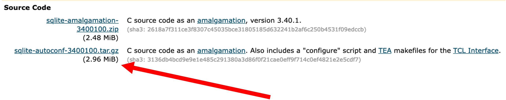

# SSDS Introduction to SQLite

[What is SQLite?](https://www.sqlite.org/index.html)

[Let's follow this helpful tutorial](https://www.sqlitetutorial.net/)

##  This workshop is divided into 3 sections and 2 challenges:
1. Install SQLite3
2. Connecting databases
3. Basic commands  
Challenge 1: Write a query  
Challenge 2: Import .csv files  
Challenge 3: Sorting data

****

## Section 1
### Install SQLite3
[First, download the sqlite3 installer.](https://www.sqlite.org/download.html)

Click the second option with the compressed file archive format `.tar.gz` 

Now, use Bash to create the `sqlite` directory, extract the archive, and lauch SQLite. 

1. Open the `Terminal` app  
2. `cd` onto your Desktop  
3. `mkdir sqlite`  
4. `cd sqlite`  
5. `tar -xzvf ~/Downloads/sqlite-autoconf-3420000.tar.gz`

> [Read more about tar flags here.](https://www.computerhope.com/unix/utar.htm)

### Run sqlite

Clear your console, then type `sqlite3` at your command line prompt to open it. 

### Find help

You will see the prompt `sqlite>`

Type `.help` to browse the help files and get familiar with basic commands.

Type `.quit` to return to your Bash prompt.

> Read more about "dot" commands: https://www.w3resource.com/sqlite/sqlite-dot-commands.php

### Download SQLite Studio

If you prefer a point and click interface instead of the command line, download SQLite Studio: https://github.com/pawelsalawa/sqlitestudio/releases

Create a folder named `gui` inside of the `sqlite` parent directory and install the contents there. Set up an SSDS consultation to learn more!

****

## Section 2
### Connecting a database
SQLite databases are stored with `.db` database file extension.

[Download the Chinook dataset to your Downloads folder.](https://www.sqlitetutorial.net/wp-content/uploads/2018/03/chinook.zip)

1. `cd` into the `sqlite` directory
2. Create `db` subdirectory inside of sqlite: `mkdir db`
3. ~~`cd` into your sqlite3/db directory~~ Make sure you are in your `sqlite` directory
4. Copy `chinook.zip` from your `Downloads` folder to the `db` folder`cp ~/Downloads/chinook.zip ./db`
5. Extract chinook.zip to find chinook.db: `unzip db/chinook.zip -d db/`
6. `ls db` should show both files "chinook.db" and "chinook.zip"

### How to connect

1. Use `pwd` to make sure you are in the `sqlite` directory
2. Connect the database to your sqlite session with: `sqlite3 db/chinook.db`
3. Congratulations! You are now using SQLite. View the included tables with `.tables`.

You can also launch sqlite first by typing `sqlite3` in your terminal, then from the sqlite prompt type:
* `attach "db/chinook.db" as db1;`

Or,

* `.open "db/chinook.db"`

Check loaded databases by typing at the sqlite prompt:

`.database`

Learn about the Chinook data. What does an SQL database look like and what are the relationships between the tables? https://www.sqlitetutorial.net/sqlite-sample-database/

****

## Section 3
### Basic commands

### `SELECT`

> Hint: remember to autocomplete commands with the TAB key when possible!

Type the command followed by an expression. Use the semicolon to end a code statement. 

> Stuck at the prompt? Also type a semicolon and press return to exit! 

`SELECT 1 + 1;`

`SELECT 10/5, 2*4;`

or

`SELECT
  10 / 5,
  2 * 4;`

### View column names

First, get column names with

`PRAGMA table_info(tracks);`

### `SELECT` columns

Then,

`SELECT composer, unitprice FROM tracks;`

### `SELECT` all columns

`SELECT * FROM tracks;`

### `ORDER BY`

Sort your data according to some variable(s).

Grab only the name, AlbumId, and UnitPrice columns from the "tracks" table, and sort ascending by name

First, communicate a slightly nicer output format:

`.header on
.mode column`

Then,

`SELECT
  name,
  AlbumId,
  UnitPrice
FROM
  tracks
ORDER BY name ASC
LIMIT 15;`

### Filter row indices

Select the top 7 rows with

`SELECT * FROM tracks
LIMIT 7;`

### Filter rows with `WHERE`

To select rows 5, 12, and 267, slice discontinuous sequences with:

`SELECT * FROM tracks WHERE rowid IN (5, 12, 267);`

If we just want rows 81 through 85, you can slice ranges with:

`SELECT * FROM tracks WHERE rowid >= 81 AND rowid <= 85;`

Filter rows using logical equivalence/equal to `=` for a single condition. Here we get all the tracks from the album "For Those About to Rock" by AC/DC.

`SELECT
  name,
  AlbumId,
  Milliseconds,
  Bytes
FROM
  tracks
WHERE
  AlbumId = 1;`

#### Filter for multiple conditions with `AND`

Slice multiple conditions using `AND`. What if we just want songs longer than 250 seconds from that same album?

`SELECT
  name,
  AlbumId,
  Milliseconds,
  Bytes
FROM
  tracks
WHERE
  AlbumId = 1 AND Milliseconds > 250000;`

#### Use `LIKE` for inexact searching

Find all bands that contain the word "metal"

`SELECT
	name,
	AlbumId,
	Composer
FROM
	tracks
WHERE
	Composer LIKE '%metal%'
ORDER BY
	AlbumId;`

#### `GROUP BY` groups!

This command can help you tabulate group frequencies, among other things.

Tabulate the number of rows by albumid:

Let's sum the number of tracks per GenreId. Note the use of `COUNT` to actually perform the summation and `LIMIT` to show just top n rows.

`SELECT
	GenreId,
	COUNT(TrackId)
FROM
	tracks
GROUP BY
	GenreId
LIMIT 10;`

### INNER JOIN

`SELECT
	tracks.albumid,
	title,
	COUNT(trackid)
FROM
	tracks
INNER JOIN albums ON albums.albumid = tracks.albumid
GROUP BY
	tracks.albumid;`

****

## Challenge 1: Write a query
1. Write a query that returns the top 10 Composers with the highest summed Unit Price.

`SELECT
  composer,
  SUM(UnitPrice)
FROM
	tracks
GROUP BY
	composer
ORDER BY COUNT(UnitPrice) DESC
LIMIT 10;`

****

## Challenge 2: Import .csv files

From your Bash prompt, type `sqlite3`

Import the city.csv file from the db directory.

`.mode csv
.mode columns
.headers on
.import "db/city.csv" city
.tables
SELECT * FROM cities LIMIT 5;`

> Note: use `.separator A_STRING` for non-comma seperators like semicolon or pipe

****

## Challenge 3: Sorting data

1. Using the city dataset, sort the population column by descending and show only the first 5 rows

****

## More useful things
### Data definitions

https://www.sqlitetutorial.net/sqlite-data-types/

`SELECT
	typeof(100),
	typeof(10.0),
	typeof('100'),
	typeof(x'1000'),
	typeof(NULL);`

### Create a new table

Create a new table named "test_datatypes"

`CREATE TABLE test_datatypes (
	id INTEGER PRIMARY KEY,
	val
);`

See that it correctly appears in `.tables`

### Populate `test_datatypes` with some data

`INSERT INTO test_datatypes (val)
VALUES
	(1),
	(2),
	(10.1),
	(20.5),
	('A'),
	('B'),
	(NULL),
	(x'0010'),
	(x'0011');`

#### `typeof` will return the data type of each value stored in the `val` column.

`SELECT
	id,
	val,
	typeof(val)
FROM
	test_datatypes
ORDER BY val;`

## Export to .sql file with `.dump`

`.output ./db/test_datatypes.sql
.dump`

## Export to .csv

`.headers on
.mode csv
.output db/example_export.csv
SELECT name , Composer, UnitPrice FROM tracks
LIMIT 10;`

`.quit`

****

## More help

Command Line Shell For SQLite: https://sqlite.org/cli.html
